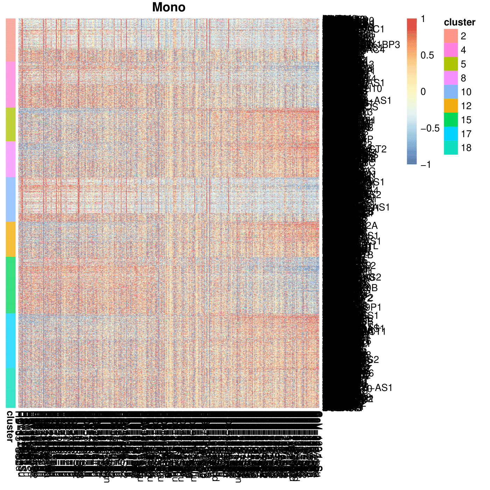

# SampleClock Package Tutorial

## Overview
SampleClock is an R package for integrating and analyzing multi-modal single-cell data across samples, specifically designed for pseudotime inference and gene expression pattern analysis. This tutorial will guide you through the process of analyzing unpaired RNA-seq and ATAC-seq data to identify temporal patterns in gene expression.

## Installation
This section covers the installation of SampleClock and its dependencies. SampleClock can be installed directly from GitHub using devtools.

```R
# Install devtools if not already installed
if (!require("devtools"))
  install.packages("devtools")

# Install SampleClock from GitHub
devtools::install_github("yiwang12/SampleClock")
```

## Required Dependencies
This section lists all necessary R packages for running SampleClock. These packages provide essential functionality for data manipulation, visualization, and analysis of single-cell data.

```R
# Load all required packages
library(tidyverse)      # For data manipulation and visualization
library(TreeCorTreat)   # For tree-based analysis
library(RColorBrewer)   # For color palettes
library(ggrepel)        # For text labels in plots
library(TSCAN)          # For trajectory analysis
library(Matrix)         # For sparse matrix operations
library(sva)            # For batch effect correction
library(preprocessCore) # For data preprocessing
library(mgcv)           # For generalized additive models
library(org.Hs.eg.db)   # For gene annotation
library(parallel)       # For parallel processing
library(igraph)         # For network analysis
library(mclust)         # For clustering
library(scran)          # For single-cell RNA analysis
library(Seurat)         # For single-cell analysis
library(ggplot2)        # For plotting
library(dplyr)          # For data manipulation
library(SampleClock)    # Main package
```

## Tutorial Steps

### 1. Data Preparation
This section focuses on loading and organizing the input data. We'll prepare both RNA-seq and ATAC-seq data, along with their corresponding metadata, which are essential for downstream analysis.

```R
# Set working directory and data paths
setwd("/your/working/directory/")
dir_data = "path/to/example/data"

# Load scRNA data
# Input: 
#   - raw_count_scRNA: matrix of raw RNA counts (genes × cells)
#   - cell_meta_scRNA: dataframe with cell metadata
#   - sampleInfo_RNA: dataframe with sample information
raw_count_scRNA = readRDS(paste0(dir_data, "/raw_count_full_scRNA.rds"))
cell_meta_scRNA = readRDS(paste0(dir_data, "/cell_meta_full_scRNA.rds"))
sampleInfo_RNA = readRDS(paste0(dir_data, "/sampleInfo_RNA.rds"))

# Load scATAC data
# Input: 
#   - raw_count_scATAC: matrix of ATAC gene activity scores (genes × cells)
#   - cell_meta_scATAC: dataframe with cell metadata
#   - sampleInfo_ATAC: dataframe with sample information
raw_count_scATAC = readRDS(paste0(dir_data, "/raw_count_full_scATAC.rds"))
cell_meta_scATAC = readRDS(paste0(dir_data, "/cell_meta_full_scATAC.rds"))
sampleInfo_ATAC = readRDS(paste0(dir_data, "/sampleInfo_ATAC.rds"))
```

### 2. Generate Pseudobulk Data
In this section, we aggregate single-cell data into pseudobulk profiles for each cell type and sample. This step reduces technical noise and computational complexity while maintaining biological signals.

```R
# Define cell type hierarchy
s <- "@All(T,Mono,B)"
hierarchy_list <- extract_hrchy_string(s,'@') 
leaves_info <- hierarchy_list$leaves_info

# Generate RNA pseudobulk data
# Input:
#   - leaves_info: cell type hierarchy information
#   - raw_count_scRNA: raw RNA count matrix
#   - cell_meta_scRNA: cell metadata
# Output:
#   - pb_RNA: list containing pseudobulk RNA data for each cell type
pb_RNA = get_tree_node_feature(
    leaves_info, 
    features = c('expr'), 
    batch = batch, 
    batch_correction = T,
    parallel = F,
    raw_count_scRNA, 
    cell_meta_scRNA, 
    filter_pct = .9
)

# Generate ATAC pseudobulk data
# Input:
#   - Similar to RNA data but for ATAC
# Output:
#   - pb_ATAC: list containing pseudobulk ATAC data
pb_ATAC = get_tree_node_feature(
    leaves_info, 
    features = c('expr'), 
    raw_count_scATAC, 
    cell_meta_scATAC, 
    filter_pct = .8
)
```


### 3. Process Pseudobulk Data
Here we normalize and process the pseudobulk data to prepare it for integration. This step ensures that the RNA and ATAC data are comparable and suitable for joint analysis.

```R
# Find common cell types between RNA and ATAC data
cellTypes_ = intersect(names((pb_RNA$all)),
                      names((pb_ATAC$all)))
cellTypes_ = cellTypes_[cellTypes_!="All"]

# Process pseudobulk data
# Input:
#   - pb_RNA/pb_ATAC: pseudobulk data lists
#   - cellTypes_: vector of cell type names
# Output:
#   - obj.RNA_Con/obj.ATAC_Con: processed expression matrices
obj.RNA_Con = process_pseudobulk(list(pb.ls=pb_RNA), cellTypes_)
obj.ATAC_Con = process_pseudobulk(list(pb.ls=pb_ATAC), cellTypes_)
```

### 4. Select Highly Variable Genes
This section identifies genes that show significant variation across samples in both RNA and ATAC data. These genes will be used as features for data integration and trajectory analysis.

```R
# Find common genes between RNA and ATAC data
# Input:
#   - obj.RNA_Con/obj.ATAC_Con: processed expression matrices
# Output:
#   - HVGs: vector of highly variable genes
genes_mono = intersect(
    rownames(obj.RNA_Con)[grep("Mono.", rownames(obj.RNA_Con))],
    rownames(obj.ATAC_Con)[grep("Mono.", rownames(obj.ATAC_Con))]
)
HVGs = select_HVG_for_integration(
    obj.RNA_Con[genes_mono,], 
    obj.ATAC_Con[genes_mono,]
)
```

### 5. Integrate Data and Assign Pseudotime
This crucial step combines the RNA and ATAC data and infers a temporal progression of samples. The integration allows us to capture concordant patterns across both modalities.

```R
# Integrate RNA and ATAC data and infer pseudotime
# Input:
#   - HVGs: highly variable genes
#   - obj.RNA_Con/obj.ATAC_Con: processed expression matrices
#   - severity levels from sample information
# Output:
#   - out_: list containing integrated data and pseudotime values
out_ = get_consistency_pseudotime_sev_integratedData(
    HVGs,
    obj.RNA_Con[HVGs,],
    obj.ATAC_Con[HVGs,],
    sampleInfo_RNA[colnames(obj.RNA_Con),"sev.level"]-1,
    sampleInfo_ATAC[colnames(obj.ATAC_Con),"sev.level"]
)
```

### 6. Visualization
This section creates various visualizations to interpret the results, including integrated sample plots, gene expression heatmaps, and trajectory visualizations. These plots help in understanding the temporal patterns and relationships between samples.

```R
# Plot integrated samples
# Input:
#   - out_: integration results
# Output:
#   - PCA and CCA plots saved to directory
plot_integrated_samples(out_, interactive=T, dir_output="out")

# Generate normalized expression data
# Input:
#   - pb_RNA: pseudobulk RNA data
#   - cellTypes_: cell type names
# Output:
#   - list_rnaGene_norm: normalized expression values
list_rnaGene_norm = get_normed_each_cellType(pb_RNA, cellTypes_, RNA = T)
list_rnaGene_norm_binned = get_normed_binned_each_cellType(
    pb_RNA, 
    cellTypes_, 
    out_$pseudotime_rna, 
    RNA = T
)

# Find gene clusters
# Input:
#   - normalized expression data
#   - cell types
# Output:
#   - clu_genes: gene cluster assignments
clu_genes = FindHVG_clusters(
    getZscore(obj.RNA_Con),
    list_rnaGene_norm, 
    list_rnaGene_norm_binned, 
    cellTypes_, 
    5000
)

# Group gene clusters by pattern consistency
# Input:
#   - normalized expression data
#   - cluster assignments
# Output:
#   - list_clusters: consistent and divergent gene clusters
list_clusters = get_consistent_divergent_clus(
    list_rnaGene_norm, 
    clu_genes, 
    cellTypes_
)

# Generate final visualizations
# Input:
#   - normalized data
#   - cluster assignments
#   - pseudotime values
# Output:
#   - Heatmaps and trajectory plots saved to directory
plot_consist_div(
    list_rnaGene_norm, 
    clu_genes, 
    list_clusters$clusters_consistent, 
    list_clusters$clusters_divergent, 
    out_$pseudotime_rna,
    interactive=T,
    dir_plot="plot"
)
```
 
 



## Output Files and Formats
The package generates several types of output files:
- **Integration Plots**: PDF/HTML files showing PCA and CCA visualizations
- **Heatmaps**: PDF files showing gene expression patterns
- **Cluster Analysis**: Text files containing cluster assignments
- **Trajectory Plots**: PDF/HTML files showing pseudotime trajectories

## Important Notes
1. Data Requirements:
   - RNA and ATAC data should be properly normalized
   - Cell metadata should include necessary annotations
   - Sample information should include severity levels

2. Memory Considerations:
   - Large datasets may require significant RAM
   - Consider using parallel processing for large datasets

3. Output Directory:
   - Ensure write permissions in output directories
   - Results will be saved in specified directories

4. Parameter Tuning:
   - Adjust filter_pct based on data sparsity
   - Modify cluster numbers based on biological expectations

## References
- SampleClock GitHub repository: https://github.com/yiwang12/SampleClock

For additional help, please refer to the GitHub repository or contact the package maintainers.
